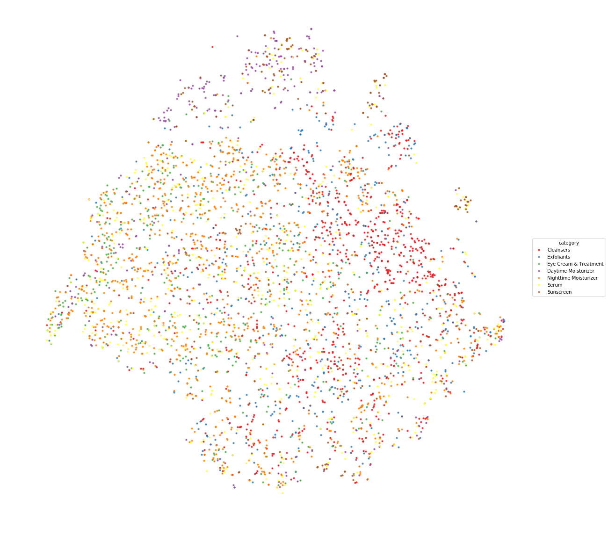
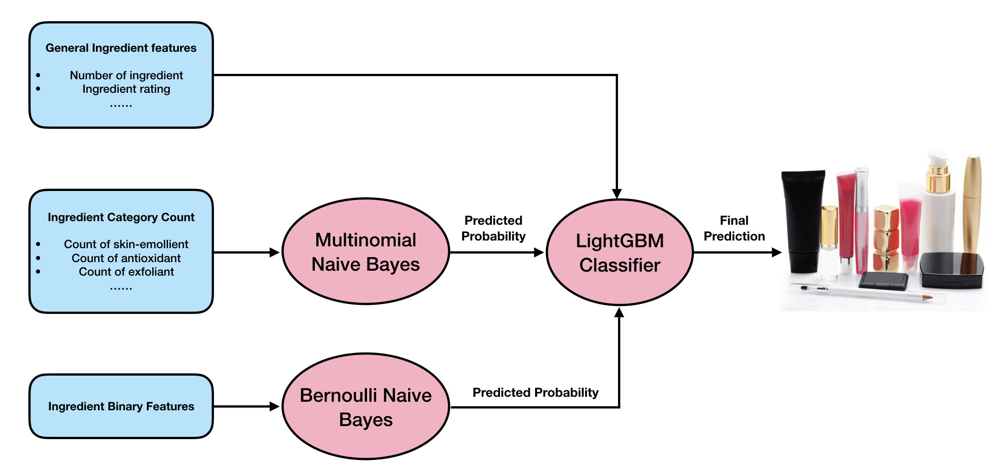
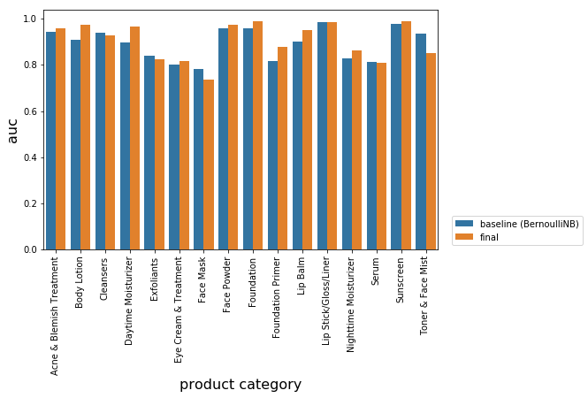
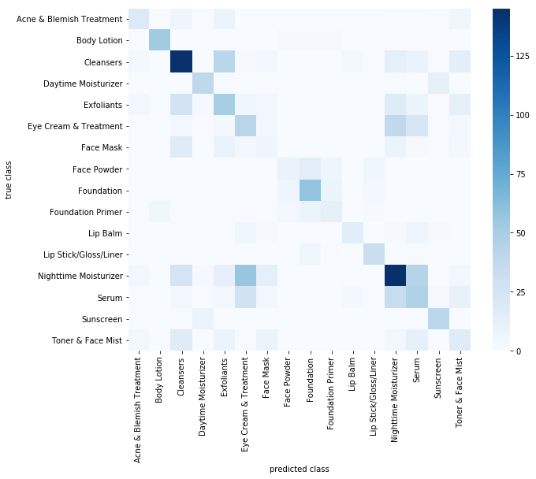

<h1> Inside Beauty</h1>

This repository is my first capstone project for Springboard data science career track. I explored ∼8000 cosmetic products, with information of brand, category, ingredients, packaging scraped from cosmetic review website [beautypedia.com](https://www.beautypedia.com). I am particulaly interested in using ingredient information to work on the following two problems that can help people understand cosmetic products from a chemical aspect:
- Classify product categories using ingredient-related features. Identify key ingredients for different product
categories. Find categories that are similar in formula (e.g. eye creams and moisturizers) that customers
may consider using in replacement of each other.
- Predict the price of products. Assess the relative importance of ingredients in determining price versus
other factors such as brand and packaging.

## Data Acquisition

Product and ingredient information are scraped from [Beautypedia](https://www.beautypedia.com) and [Paula’s choice](https://www.paulaschoice.com/ingredient-dictionary) websites. These are websites run by Paula Begoun and her team, where they constantly post reviews on cosmetic products.
* Product information. 
    * name: product name 
    * category: subcategory of products 
    * brand: product brand 
    * ingredient: list of ingredients in a product 
    * image: product image

We created three main tables for skin care, body care and makeup products. Products are further divided into subcategories such as moisturizer, serum, sunscreen, exfoliator…, and one product may belong to multiple categories. There are 4810, 419, 2513 unique products for skin care, body care and makeups, respectively. 

* Ingredient information of 1750 ingredients.
    * name: ingredient name 
    * rating: rating of each ingredient according to Paula and her team 
    * category: ingredient category -- indicate an ingredient’s function in products. An ingredient may belong to several categories.
    
Webscrapers can be found here: [beautypedia_scraper.ipynb](https://github.com/NoxMoon/inside_beauty/blob/master/web_scraper/beautypedia_scraper.ipynb),
[beautypedia_ingredient_scraper.ipynb](https://github.com/NoxMoon/inside_beauty/blob/master/web_scraper/beautypedia_ingredient_scraper.ipynb)

## Data Cleaning

#### Ingredient Matching
Different companies may list the same ingredient in different ways. The most common ingredient water, can appear as “water”, “water (aqua)”, “Water/Aqua/Eau”, “purified water”… in different products. To reduce sparsity of the ingredient features and make use of ingredient information in the ingredient dictionary dataset we obtained, we try to match all ingredients to the 1750 existing ingredients. We use the SequenceMatcher from python difflib package for this purpose. SequenceMatcher provides overall satisfactory matching results with mistakes occasionally, for example, lactic acid is mistakenly matched to acetic acid, zea mays (corn germ) oil is matched to wheat germ oil. Currently, we set a threshold of 0.25 and ingredients with match metric below that will be labelled as unknown ingredients.

#### Further Cleaning and Feature Engineering
We follow the following pipeline to cleaning our data and generate more features:
* Drop products that are not "chemical" products, like makeup brushes, cleaning devices.
* Merge some categories.
* Split 'size' column to a number and unit, do unit conversion as necessary
* Compute 'price/size'
* Basic cleaning on ingredients:
    * Split inactive and active ingredient
    * Convert ingredients to a list
    * Find number of inactive and active ingredient
    * Check if the ingredients are in alphabatical order -- most companies like to list ingredient in a descending order of their quantity in the product, some companies just list ingredients alphabatically.
* Look up ingredients in our ingredient dictionary.
    * Get a set of all unique ingredients in the products dataframe
    * Find the match of all these ingredients
    * For all product, we loop over its ingredient list and look up the matching ingredient, rating and ingredient category
    * Count how many ingredients in a product have a certain rating (how many ingredient rated as Good/Average etc.)
    * Count how many ingredients in a product belongs to a certain category (how many antioxidants/sunscreen etc.)
    * Count some special categories of ingredients. For example, peptides, ingredients called "xxx extract"...
    * Compute average ingredient rating. For inactive ingredient, we also consider two kinds of weighted average.
    * We can make a giant binary matrix indicating all ingredients' presense in each product. We may need dimensionality reduction techniques to preprocess these features for some machine learning models.
    
Datacleaning notebook can be found here: [data_cleaning.ipynb](https://github.com/NoxMoon/inside_beauty/blob/master/data_cleaning/data_cleaning.ipynb)

#### Logo Image Filtering
Some products on Beautypedia do not have real product photos but a logo for the brand. We build a simple classifier trained on hand picked small data set (with 104 logo samples and 283 non-logo samples) to filter these log images.

Image filtering notebook can be found here: [image_preprocessing.ipynb](https://github.com/NoxMoon/inside_beauty/blob/master/data_cleaning/image_preprocessing.ipynb)

## Exploratory Data Analysis

#### Visualization
We explored the following aspects with graphical EDA:
* Unique products
* Missing values
* Number of products by category
* Number of products by brand
* Price v.s. category
* Price v.s. brand
* Price v.s. ingredient
    * Is price related to the number of ingredient?
    * Is price related to the quality of ingredient?
* Price v.s. ingredient category
    * What kind of ingredient is more associated with expensive products?
    * Do those categories have higher rating?
* Ingredient Frequency

The notebook can be found here: [exploratory_data_analysis.ipynb](https://github.com/NoxMoon/inside_beauty/blob/master/eda/exploratory_data_analysis.ipynb)

#### Statistical test
In graphical EDA, we have seen many factors can contribute to cosmetic products' price. We can also use statistical test to evaluate the significance of these variables. We mainly looked at the following variables:
* Product Category
* Brand
* Ingredient
    * Number of ingredient
    * Ingredient rating
    * Ingredient category
    * Individule ingredient
    
Statistical test notebook can be found here: [statistical_test_price.ipynb](https://github.com/NoxMoon/inside_beauty/blob/master/eda/statistical_test_price.ipynb)

## Machine Learning

### tSNE with ingredient features

We attempted to run some tSNE plots with ingredient features, and see if products belonging to the same category come close together in tSNE plot. It turns out it's not easy to separate different categories in a tSNE plot. The reason may be that there are too much noise with all the ingredient count. Those ingredient that are less relevant to product category contribute equally to the tSNE model, making it hard to reveal the pattern related to product category. However, after pruning individuel ingredients (by choosing ingredients with high chi2 statistics with category) and add other ingredient-related features such as count and rating, we are able to see a vague cluster of cleansers (red dots), and a cluster which is mostly a mixture of sunscreen and daytime moisturizer (purple and brown dots):

Still, the tSNE plot looks quite noisy. Eye creams, nighttime moisturizer and serums tend to mix together, which may not be a surprise as they are similar after all. We would want to do supervised learning to see if we can distiguish product category further.

tSNE plots can be found here: [tSNE.ipynb](https://github.com/NoxMoon/inside_beauty/blob/master/machine_learning/tSNE.ipynb)

### Product category classification with ingredient features

We attempted to predict a product's category using only ingredient related features. As one product may belong to multiple categories, we can do one vs rest classification to tackle the multilabel problem. We use scikit-learn's OneVsRestClassifier for this task.

The ingredients are like the words in documents, thus many techniques people use for text data can be applied here. We can create a "bag of ingredients" matrix, where the matrix elements are binary indicators of whether a certain ingredient exists in a certain product. In addition, we also have "bag of ingredient categories" features that counts how many ingredients of an ingredient category are in a product. As in text data, Naive Bayes can be a good baseline model. We use Bernoullie Naive Bayes for binary features and Multinomial Naive Bayes for count features.

There are also some general ingredient features that could potentially be useful, such as number of ingredients. We can make use of these features though model stacking: the naive bayes models will serve as first layer models, then the predicted probabilities can be joined with general ingredient features to feed in the final model.
The training pipeline is as follows:

We focused on 16 categories which have more than 100 products in the dataset.

#### Bernoulli Naive Bayes with binary ingredient features

The Bernoulli Naive Bayes serves as a good baseline model. It achieves 0.3724 Hamming score on training set with cross validation, and 0.3588 on test set. Naive Bayes also allows us to indentify the key ingredient associated with each category, for example:

* Acne Treatment products: benzoyl peroxide, BHA
* Cleansers: solium xxx (sodium salt of fatty acids)
* Exfoliants: AHA, BHA
* Lipsticks: Coloring Agents/Pigments
* Sunscreens: octocrylene, homosalate... (common sunscreen agents)

#### Multinomial Naive Bayes with ingredient category count features
We achieved 0.2707 Hamming score using ingredient categories alone. The results is not good enough by itself, but the predictions can be useful features for the final model.

#### Final Prediction with LightGBM

We stacked general ingredient features (number of ingredient, average/weighted rating of ingredients in products) and the predictions of the above two models to train the final model --- LightGBMClassifier. The final Hamming score is 0.4837 for cross-validation on training set and 0.5111 on test set, which is a significant improvement compare to Naive Bayes. We also improved the auc score of 10 product categories.

 

We can also visualize the model predictions using confusion matrix and find the pairs of categories that our model get confused with.

Overall, the results do agree with our life experience. The model gets confused on similar categories. For example, daytime moisturizers often have sunscreen ingredients in it, so sometimes our model cannot distiguish sunscreens and daytime moisturizer. Nighttime moisturizer, eye creams and serum are another group that our model get confused a lot in real life, they are all products that are supposed boost hydration and may have some special functions such as anti-aging, reduce hyperpigmentation... It is interesting to see that face masks got confused with cleansers, Exfoliants, and nighttime moisturizer. This is because there are typically two types of face masks: cleansing mask, which may have similar ingredient like cleansers and exfoliants. Another is the so called "sleeping mask", which you can wear overnight, they are typically like a heavy nighttime moisturizer.

Checkout these two miss-predicted face maskes (the first one I have used it as moisturizer personally).
* [Clinique Moisture Surge™ Overnight Mask](https://www.clinique.com/product/14706/24569/skin-care/masks/moisture-surge-overnight-mask?gclid=CjwKCAjw39reBRBJEiwAO1m0OVFl9Wm4Twl06ADx6fvEDT1Clz9KC6vC9SC9RaMHB1u5YWXHUG9AxRoC25IQAvD_BwE&gclsrc=aw.ds), predicted as Eye Cream & Treatment and Nighttime Moisturizer:

* [Clinique Pep-Start Double Bubble Purifying Mask](https://www.clinique.com/product/14706/45672/skin-care/masks/clinique-pep-start-double-bubble-purifying-mask), predicted as Cleansers.

One limitation of our model is that we didn't quite consider the quantity of ingredients. If we have that information, we can probably do better on toner & face mist, because although the ingredients in toner may look similar as in other products, toners usually contains much more water than other categories.

Product category classification notebook can be found here: [product_category_classification.ipynb](https://github.com/NoxMoon/inside_beauty/blob/master/machine_learning/product_category_classification.ipynb)

### Price Regression

Price regression notebook can be found here: [price_regression.ipynb](https://github.com/NoxMoon/inside_beauty/blob/master/machine_learning/price_regression.ipynb)
