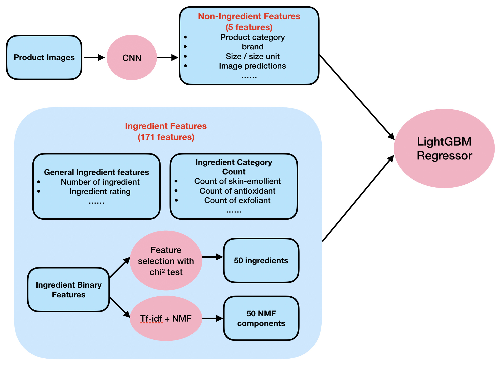

<h1> Inside Beauty</h1>

This repository is my first capstone project for Springboard data science career track. I explored ∼8000 cosmetic products, with information of brand, category, ingredients, and packaging scraped from cosmetic review website [beautypedia.com](https://www.beautypedia.com). I am particulaly interested in using ingredient information to work on the following two problems that can help people understand cosmetic products from a chemical perspective:
- Classify product categories using ingredient-related features. Identify key ingredients for different product
categories. Find categories that are similar in formula (e.g. eye creams and moisturizers) that customers
may consider using in replacement of each other.
- Predict the price of products. Assess the relative importance of ingredients in determining price versus
other factors such as brand and packaging.

Final report of this project can be found [here](https://github.com/NoxMoon/inside_beauty/blob/master/documents/final%20report.md)

**Packages used**: numpy, scipy, statsmodel, scikit-learn, pandas, lightgbm, pytorch, skimage, difflib, seaborn, matplotlib, BeautifulSoup, selenium.

## Data Acquisition

Product and ingredient information are scraped from [Beautypedia](https://www.beautypedia.com) and [Paula’s choice](https://www.paulaschoice.com/ingredient-dictionary) websites. These are websites run by Paula Begoun and her team, where they constantly post reviews on cosmetic products.
* Product information. 
    * name: product name 
    * category: subcategory of products 
    * brand: product brand 
    * ingredient: list of ingredients in a product 
    * image: product image

We created three main tables for skin care, body care and makeup products. Products are further divided into subcategories such as moisturizer, serum, sunscreen, exfoliator, etc., and one product may belong to multiple categories. There are 4810, 419, 2513 unique products for skin care, body care and makeups, respectively. 

* Ingredient information of 1750 ingredients.
    * name: ingredient name 
    * rating: rating of each ingredient according to Paula and her team. 
    * category: ingredient category -- indicate an ingredient’s function in products. An ingredient may belong to several categories.
    
Webscrapers can be found here: [beautypedia_scraper.ipynb](https://github.com/NoxMoon/inside_beauty/blob/master/web_scraper/beautypedia_scraper.ipynb),
[beautypedia_ingredient_scraper.ipynb](https://github.com/NoxMoon/inside_beauty/blob/master/web_scraper/beautypedia_ingredient_scraper.ipynb)

## Data Cleaning

#### Ingredient Matching
Different companies may list the same ingredient in different ways. For example, water can appear as “water”, “water (aqua)”, “Water/Aqua/Eau”, “purified water”… in different products. To reduce sparsity of the ingredient features and make use of ingredient information in the ingredient dictionary dataset we obtained, we used the [SequenceMatcher](https://docs.python.org/2/library/difflib.html) to match all ingredients to the 1750 existing ingredients. This provides overall satisfactory matching results with mistakes occasionally (e.g. lactic acid --> acetic acid).

#### Further Cleaning and Feature Engineering
We followed the following pipeline to cleaning our data and generate more features:
* Drop "non-chemical" categories such as makeup brushes, cleaning devices.
* Merge some categories.
* Split 'size' column to a number and unit; do unit conversion if necessary.
* Compute the price/size ratio.
* Ingredient features:
    * Find number of inactive and active ingredient
    * Whether ingredient list is in alphabatical order or descending order of ingredients quantity.
    * Count ingredients of certain rating (how many ingredient rated as Good/Average etc.)
    * Count ingredients of a certain category (how many antioxidants/sunscreen etc.)
    * Count some special categories of ingredients, e.g. peptides, ingredients called "xxx extract"...
    * Average or weighted rating.
    * Binary matrix indicating all ingredients' presense in each product. 
    
Data-cleaning notebook can be found here: [data_cleaning.ipynb](https://github.com/NoxMoon/inside_beauty/blob/master/data_cleaning/data_cleaning.ipynb)

#### Image Preprocessing and Logo Image Filtering
Some products on Beautypedia do not have real product photos but a logo of the brand. We built a simple classifier trained on hand picked small data set (with 104 logo samples and 283 non-logo samples) to filter these log images. We are left with 6324 unique non-logo images.

Image preprocessing and filtering notebook can be found here: [image_preprocessing.ipynb](https://github.com/NoxMoon/inside_beauty/blob/master/data_cleaning/image_preprocessing.ipynb)
[logo_image_filter.ipynb](https://github.com/NoxMoon/inside_beauty/blob/master/data_cleaning/logo_image_filter.ipynb)

## Exploratory Data Analysis

#### Visualization
We explored the following aspects with graphical EDA:
* Unique products
* Missing values
* Number of products by category
* Number of products by brand
* Price v.s. category
* Price v.s. brand
* Price v.s. ingredient
    * Is price related to the number of ingredient?
    * Is price related to the quality of ingredient?
* Price v.s. ingredient category
    * What kind of ingredient more commonly appears in expensive products?
    * Do those categories have higher rating?
* Ingredient Frequency

The EDA notebook can be found here: [exploratory_data_analysis.ipynb](https://github.com/NoxMoon/inside_beauty/blob/master/eda/exploratory_data_analysis.ipynb)

#### Statistical test
In graphical EDA, we have found that many factors can contribute to cosmetic products' price. We can also use statistical tests to evaluate the statistical significance of these variables:
* Product Category (ANOVA and pairwise t-test)
* Brand (ANOVA and pairwise t-test)
* Ingredient
    * Number of ingredient (slope test)
    * Ingredient rating (slope test)
    * Ingredient category (F test)
    * Individule ingredient (chi2 test)
    
Statistical test notebook can be found here: [statistical_test_price.ipynb](https://github.com/NoxMoon/inside_beauty/blob/master/eda/statistical_test_price.ipynb)

## Machine Learning

### tSNE with ingredient features

It is not easy to separate different categories in a tSNE plot only using all binary ingredient features. We are able to see a vague cluster of cleansers (red dots), and a cluster which is mostly a mixture of sunscreen and daytime moisturizer (purple and brown dots). In general, the tSNE plot looks quite noisy. Eye creams, nighttime moisturizer and serums tend to mix together.

tSNE plots can be found here: [tSNE.ipynb](https://github.com/NoxMoon/inside_beauty/blob/master/machine_learning/tSNE.ipynb)

### Product category classification with ingredient features

We attempted to predict a product's category using only ingredient related features. As one product may belong to multiple categories, we used scikit-learn's OneVsRestClassifier to tackle the multilabel problem.

The ingredients are like the words in documents, thus many techniques for text data can be applied here. We created a "bag of ingredients" matrix, where the matrix elements are binary indicators of whether a certain ingredient exists in a certain product. In addition, we had "bag of ingredient categories" features that counts how many ingredients of an ingredient category are in a product. We used Bernoullie Naive Bayes for binary features and Multinomial Naive Bayes for count features. We then make use of general ingredient features (number of ingredients/rating) through model stacking: the Naive Bayes models will serve as first layer models, then the predicted probabilities can be joined with general ingredient features to feed in the final model.

The training pipeline is as follows:

The Bernoulli Naive Bayes serves as a good baseline model and achieves 0.3724 Hamming score on training set with cross validation, and 0.3588 on test set. It also allows us to indentify the key ingredient associated with each category. For example:

* Acne Treatment products: benzoyl peroxide, BHA
* Cleansers: solium xxx (sodium salt of fatty acids)
* Exfoliants: AHA, BHA
* Lipsticks: Coloring Agents/Pigments
* Sunscreens: octocrylene, homosalate... (common sunscreen agents)

After stacking. the final LightGBMClassifier has Hamming score of 0.4837 for cross-validation on training set and 0.5111 on test set, which is a significant improvement compare to Naive Bayes. We also improved the auc score of 10 product categories.

 

We can also visualize the model predictions using a confusion matrix and find the groups of categories that our model gets confused with.

Overall, the model gets confused on similar categories in real life. For example, daytime moisturizers and sunscreens, as daytime moisturizers often have sunscreen ingredients as well. Nighttime moisturizer, eye creams and serum, which are all products that are supposed to boost hydration and may have some special functions such as anti-aging, reduce hyperpigmentation, etc. Interestingly, face masks were often misclassified as cleansers, Exfoliants, and nighttime moisturizer. Apparently there are two types of face masks: cleansing mask, which may have similar ingredients like cleansers and exfoliants; or the so-called "sleeping mask", which are typically like a heavy nighttime moisturizer and people can wear overnight.

Product category classification notebook can be found here: [product_category_classification.ipynb](https://github.com/NoxMoon/inside_beauty/blob/master/machine_learning/product_category_classification.ipynb)

### Price Regression
We built a LightGBM regression model to predict a product's price with both ingredient and non-ingredient features, and assessed the relative importance of ingredients in determining price versus other factors such as brand and packaging.

Model pipeline:

We measured the RMSE, MAE and explained variance when using non-ingredient features or ingredient features alone and using all features. Right now, the ingredient features are not as powerful as non-ingredient features. The five non-ingredient features alone achieved MAE = \$10.875. Adding 171 ingredient features only improved the results marginally. The most powerful features (by LightGBM feature importance) are brand and product category.

|error\features| non-ingredient features only  | ingredient features only | all features |
|-|:--|:--|:--|
|RMSE(\$) (train cv)| 22.280 |27.445 |21.393 |
|RMSE(\$) (test )|18.629 | 24.803 | 17.100|
|MAE(\$) (train cv)|12.322 | 17.130|11.692 |
|MAE(\$) (test)|10.875 | 16.298| 10.257|
|explained variance (train cv)|0.610 | 0.408 |0.640 |
|explained variance (test)| 0.683 | 0.438|0.732 |

Price regression notebook can be found here: [price_regression.ipynb](https://github.com/NoxMoon/inside_beauty/blob/master/machine_learning/price_regression.ipynb)
[packaging_to_price.ipynb](https://github.com/NoxMoon/inside_beauty/blob/master/machine_learning/packaging_to_price.ipynb)

### Final Words

We note that there are several limitations in the current model. For example, product texture can help a lot when distinguishing toners and other products, but it is hard to exploit that information from ingredient lists. In the future, we may work on the following aspects to furthur improve the current model:
* Explore other methods for ingredient matching, such as algorithms based on Levenshtein distance.
* Finding more data from other resourses can help improve the models. Currently, many brands and categories do not have enough products. 
* Improve the price prediction using product images.

Finally, I want to say that while I believe understanding the formula of cosmetic products and having a knowledge on what are inside the products can help people spend their money more rationally and be realistic with their expectation on the products, I think sometimes it is totally fine to buy products not for need, but for fun! I hope you enjoy browsing though this work and find it interesting!
